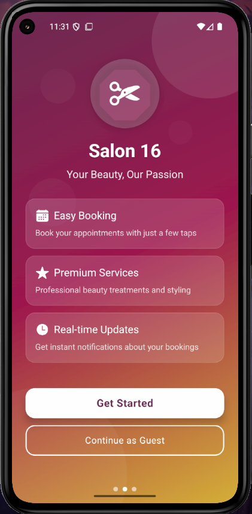
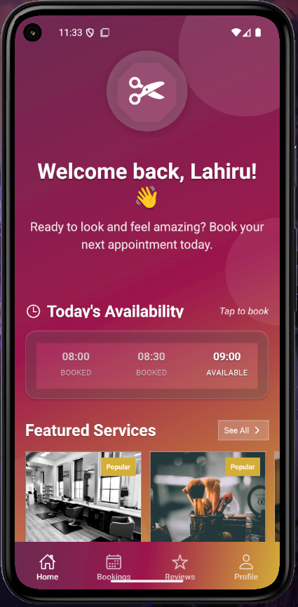
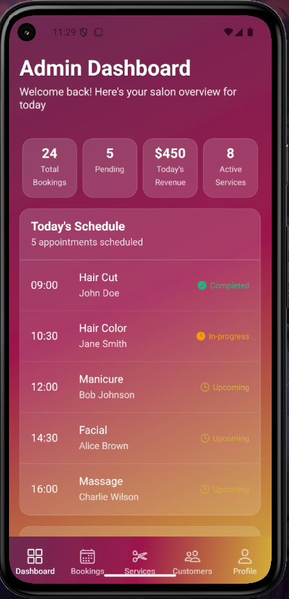

# 💇‍♀️ Salon 16 – Mobile Booking App  

Salon 16 is a **cross-platform mobile-first application** built with **React Native** to simplify salon appointment management. Customers can browse services, check availability, and make bookings, while admins can manage services, bookings, and customer interactions in real time.  

---

## ✨ Features  

### 👩 Customer Side  
- Browse salon services with details and pricing  
- Book, reschedule, or cancel appointments  
- View upcoming and past bookings  
- Receive booking confirmations and reminders  
- Add reviews and ratings after services  

### 🛠️ Admin Side  
- Manage salon services (create, update, delete)  
- Upload service images (manual upload)  
- Approve or reject bookings  
- Track revenue and bookings through an admin dashboard  
- Manage customer reviews and feedback  

---

## 📸 Screenshots

Here are some previews of the **Salon 16 Mobile App**:

### 👩 Customer Side
 

### 🛠️ Admin Side
 

---

## 🏗️ Tech Stack  
- **Frontend**: React Native (Expo) + React Native Web (for web support / optional PWA)  
- **Backend**: Firebase (Firestore, Auth, Storage, Cloud Functions)  
- **Hosting (optional)**: Firebase Hosting / Vercel (for PWA deployment)  
- **UI**: Tailwind (via NativeWind) + custom design tokens  

---

